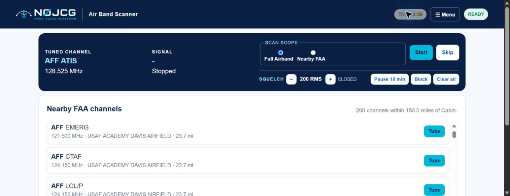
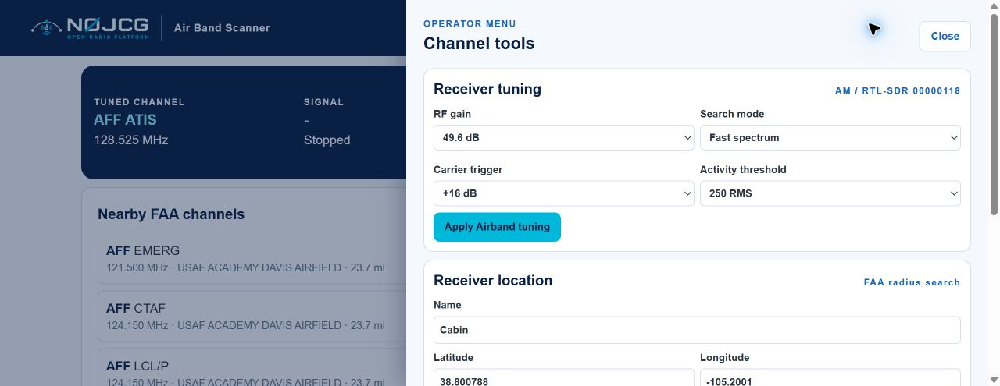

# N0JCG Air Band Scanner User Guide

Release `v0.1.3`

## Product boundary

N0JCG Air Band Scanner is a standalone, receive-only civil Airband application. It does not transmit, key a radio, decode encrypted traffic, or share runtime ownership with N0JCG NOAA Weather Radio, N0JCG Scanner, or N0JCG Air Traffic Center.

## Hardware

Use the RTL-SDR programmed with EEPROM serial `00000118`. Connect an antenna and filter path appropriate for approximately 118–137 MHz. The scanner identifies the receiver by serial, never by a temporary USB index. It requires `rtl_power` and `rtl_fm` on the host.

## Install

On Raspberry Pi OS, copy the repository to the Pi and run `sudo ./deploy/install.sh`. The UI is served on port `8087`. Run `./deploy/install.sh --check-only` before installation to distinguish missing tools from RF problems.

## Trial and registration

An unregistered installation starts a five-minute trial when scanning or tuning first begins. The header shows the remaining time; the trial control is disabled while the timer is running. When the trial expires, the same control becomes **Restart Trial** and scanning/tuning controls remain disabled until it is selected. Registered installations hide the trial control and do not use the trial timeout.

To register, open **Menu → Registration**, enter the N0JCG license S/N and the registered purchaser email, and select **Activate license**. Air Band Scanner uses the following product registration identity:

- Product name: **N0JCG Air Band Scanner**
- Product ID: `n0jcg-air-band-scanner`
- License prefix: `N0JCG-ABS-`

Activation is sent through the application backend to the N0JCG licensing service; the signed license lease is cached locally for continued operation and refresh. After successful registration, the trial timer/status control is removed from the header.

## Tuning and location controls

The Airband tuning defaults follow the N0JCG Air Traffic Center baseline: AM demodulation, 40.2 dB RF gain, 1300 RMS activity threshold, fast spectrum search, and an 8 dB carrier margin. Use **Apply Airband tuning** to save changes. The RF gain affects both FFT survey and live AM tuning.

Playback squelch is independent of the activity threshold. Use the compact minus and plus controls in the main blue panel to change squelch in 100 RMS steps. A value of 0 is open squelch; a positive value mutes audio below the selected RMS level. If a scanned channel remains quiet below squelch for 7 seconds, the scanner releases it and resumes the selected scan scope.

Enter the receiver name, antenna latitude/longitude, and search radius, then save the location. **Scan nearby FAA** uses the current FAA NASR catalog and only scans known channels within that radius. The **Nearby FAA channels** panel provides direct Tune controls for each returned channel.

## Operation

1. Open the station URL and confirm serial `00000118`.
2. Select **Full Airband** or **Nearby FAA**, then press **Start**. The button changes to **Stop** while the scanner is running. The service surveys 118.000–136.975 MHz, scores every channel in the loaded catalog, and selects the strongest candidate meeting the 6 dB SNR gate.
3. Select **Scan nearby FAA** to survey only channels inside the saved receiver radius.
4. Open **Menu** to select an airport code such as `KDEN`, or use the nearby FAA list on the main page. Use **Tune** beside a published ATIS, tower, ground, approach, or UNICOM frequency.
5. Browser audio starts automatically after a valid tuned channel is shown. It is delivered as scheduled 0.5-second, valid WAV chunks containing 24 kHz mono audio from the AM demodulator. Use **Stop** to end scanning and audio.
6. A direct **Tune** is a persistent manual lock: the selected channel remains tuned through the seven-second silence timeout and does not start a new scan. Use **Start** to begin scanning again, or **Stop** to end scanning and audio.
7. During scanning, when a channel is quiet for 7 seconds, the scanner automatically releases it and scans for another candidate. Use **Skip** to pause the current channel for 10 minutes and continue scanning.

## Channel scan controls

The compact **Pause 10 min**, **Block**, and **Clear all** controls are in the main blue panel and act on the currently locked scanning channel. **Pause 10 min** removes a frequency from FFT scanning for ten minutes and then automatically makes it eligible again. **Block** removes it from scanning until **Clear all** is selected. These controls are saved in the standalone scanner settings and survive service restarts. They affect scanning only; **Tune** remains a deliberate direct-listening lock.

The airport-code lookup, FFT candidates, receiver tuning, and receiver location settings are in the scrollable **Menu**. The Nearby FAA channel list remains on the main page and has its own scroll area.
8. Stop scanning before changing hardware or sharing the receiver with another application.

## Current interface reference

The main page provides scan scope, Start/Stop, Skip, compact squelch controls, current-channel Pause/Block/Clear, and Nearby FAA Tune actions.

The operator menu contains receiver tuning, receiver location/radius, airport-code lookup, and FFT candidate tools.

## Audio and RF reference

For the complete receive command, sample-rate, demodulator, browser playback, squelch, timeout, diagnostics, and acceptance-test reference, see [AIRBAND_AUDIO_RF_TEMPLATE.md](AIRBAND_AUDIO_RF_TEMPLATE.md).

## Catalog maintenance

`web/data/airband-channels.json` contains a small development seed. Import current FAA NASR FRQ data with `tools/import_faa_catalog.py`; review the generated file before deployment. Airport-code availability is only as current as the imported FAA source.

## Troubleshooting

Service health and USB presence do not prove RF reception. If no candidate appears, check the serial with `rtl_test -d 00000118`, antenna/filter connections, gain, and local channel activity. A clean simulated scan proves application logic only; live FFT and audio commissioning remain hardware-dependent.
